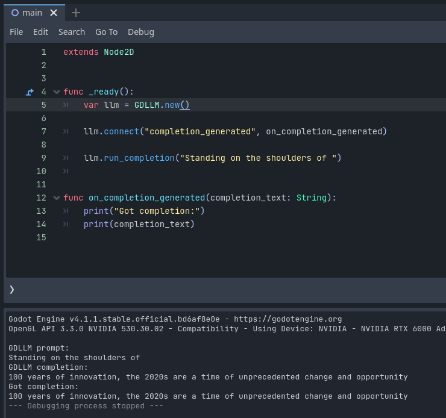

# Introduction

Trying to integrate an LLM into Godot.

First use-case: for spicing up NPC chatter.

# Work log

See [docs/worklog.md](docs/worklog.md).

# Quickstart

```
mkdir -p models
cd models
wget https://huggingface.co/TheBloke/Mistral-7B-Instruct-v0.1-GGUF/resolve/main/mistral-7b-instruct-v0.1.Q5_K_M.gguf
cd ..

git clone https://github.com/ggerganov/llama.cpp.git llama_dot_cpp
git clone https://github.com/godotengine/godot-cpp.git

cp SConstruct-llamacpp llama_dot_cpp/SConstruct
cd llama_dot_cpp
scons -j31
cd ..

cd godot-cpp
git checkout godot-4.1.1-stable
cp gdextension/extension_api.json ../the-game/extension_api.json
scons platform=linux -j31 custom_api_file=$(pwd)/../the-game/extension_api.json
cd ..

cp llama_dot_cpp/libllama.so the-game/bin
# build my gdextension here:
scons platform=linux -j31

cp models/mistral-7b-instruct-v0.1.Q5_K_M.gguf the-game/bin/
# load the game in Godot
```

Note that if you run `scons -c` in the root, it will remove the built dependencies in `llama_dot_cpp`, so scons have to be run for the latter again for building the extension.

So, any future iterations look like this:

```
rm the-game/bin/*.so;  scons -c
# make changes to the extension code
cd llama_dot_cpp
scons -j31
cd ..
cp llama_dot_cpp/libllama.so the-game/bin
scons platform=linux -j31
```

Or

```
rm the-game/bin/libgdllm.linux.template_debug.x86_64.so
rm src/*.os
scons platform=linux -j31
```

If any experts in scons/c++ reads this, I think the `SConstruct-llamacpp` step is probably unnecessary, and that I can get away with building llama.cpp using its own Makefile, and then just linking to the resulting `.a` file in the extension's `SConstruct` file. But I'm not sure how to do that.

But for now, it works:

